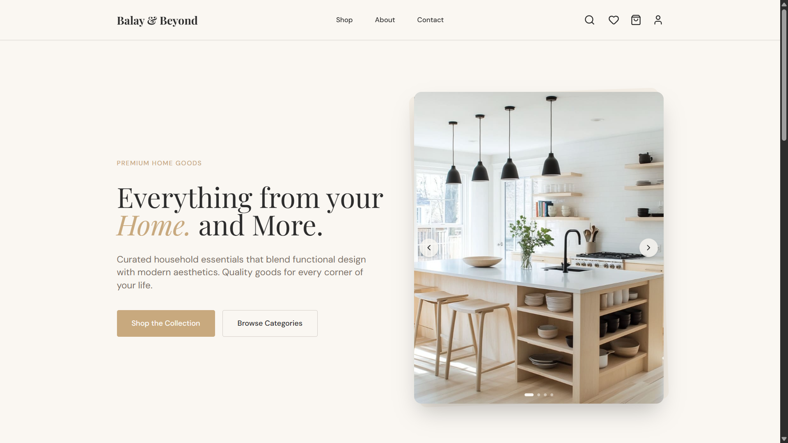
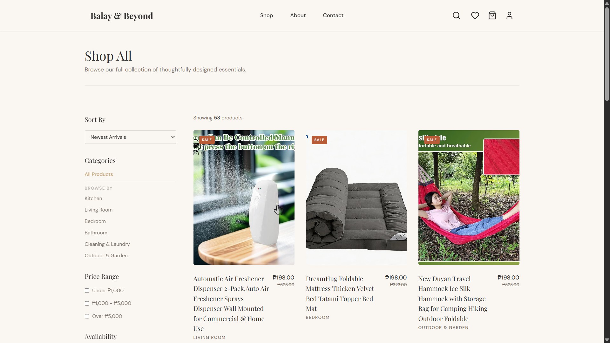
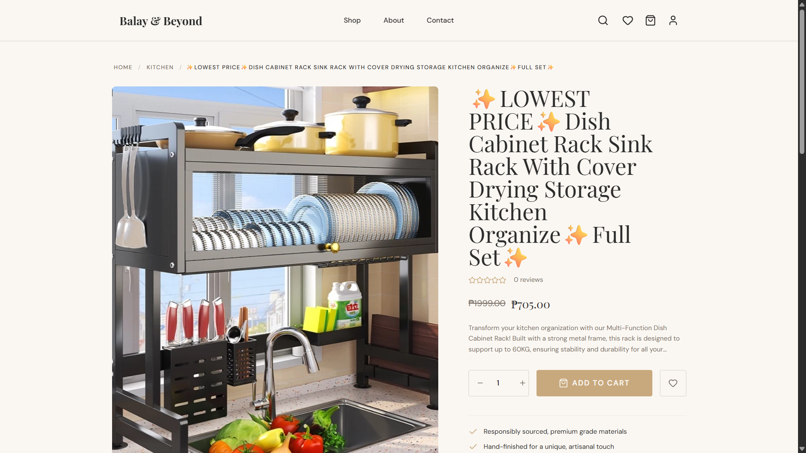
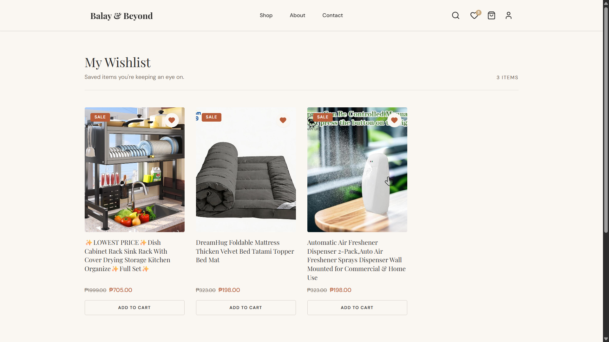
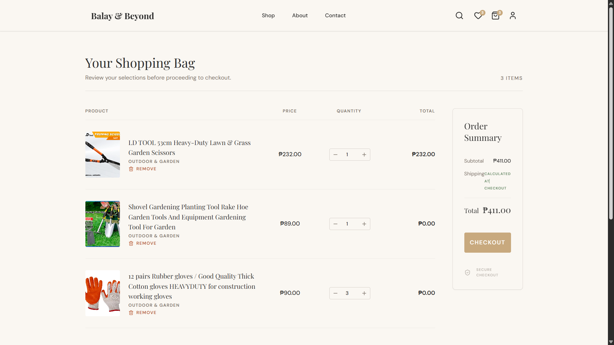

<div align="center">

# Balay & Beyond

<p align="center">
  
</p>

[](https://python.org)
[](https://djangoproject.com)
[](LICENSE)

**A premium Django e-commerce platform engineered for curated home essentials and modern living spaces.**

[Report a Bug](https://github.com/Huerte/BalayAndBeyond/issues) · [Request a Feature](https://github.com/Huerte/BalayAndBeyond/issues)

</div>

---

<p align="center">
  Welcome to Balay & Beyond! We make it simple to explore, filter, and buy home essentials online. Our platform is built to be fast, beautiful, and easy to use.
</p>

---

## Table of Contents

- [Installation Guide](#installation-guide)
- [What It Shows](#what-it-shows)
- [How It Works](#how-it-works)
- [Visual Tour](#visual-tour)
- [Deployment (Render)](#deployment-render)
- [Contributing](#contributing)
- [Contributor](#contributor)
- [License](#license)

---

## Installation Guide

We want to make it as easy as possible for anyone to run Balay & Beyond on their computer. You don't need to be an expert to get started. Just follow these simple steps!

### Prerequisites

Before we start, make sure you have:
* **Python 3.10 or higher**: This is the programming language we use. You can download it from [python.org](https://www.python.org/downloads/).
* **Git**: This tool helps you download our code.

### Simple Steps to Run the App

1. **Download the code**
   Open your computer's terminal (or command prompt) and type this, then press Enter:
   ```bash
   git clone https://github.com/Huerte/BalayAndBeyond.git
   ```
   Now, go into the project folder you just downloaded:
   ```bash
   cd BalayAndBeyond
   ```

2. **Create a safe space for your app**
   We use a "virtual environment" to keep our app's parts separate from the rest of your computer.
   ```bash
   python -m venv venv
   ```
   Now, turn it on:
   - **For Windows:** `venv\Scripts\activate`
   - **For Mac/Linux:** `source venv/bin/activate`

3. **Install the required tools**
   We have a list of tools our app needs. Let's install them all at once:
   ```bash
   pip install -r src/requirements.txt
   ```

4. **Set up the app's settings**
   We need a small file to hold your local settings. Let's copy the example file we provided:
   - **For Windows:** `copy src\.env.example src\.env`
   - **For Mac/Linux:** `cp src/.env.example src/.env`
   *(You can open this `src/.env` file later if you want to connect a real database, but for now, the default settings are fine).*

5. **Prepare the database**
   Let's create the tables where our products will be saved:
   ```bash
   cd src
   python manage.py migrate
   ```
   Then, create an admin account so you can manage the store:
   ```bash
   python manage.py createsuperuser
   ```
   Follow the prompts to type your new username, email, and password.

6. **Start the app!**
   Finally, run the app:
   ```bash
   python manage.py runserver
   ```
   Now, open your web browser (like Chrome or Safari) and go to **`http://127.0.0.1:8000`**. You should see Balay & Beyond!

---

## What It Shows

Here are the key features of Balay & Beyond:

| Feature | What it means |
|---------|---------------|
| **Dynamic Filter System** | Easily find products by category, price, and stock without the page reloading. |
| **Intelligent Cart** | Add or remove items from your cart instantly, with real-time updates. |
| **Bento-Grid Dashboard** | A beautiful, dark-mode admin panel to easily manage your shop. |
| **Auto-Generating SKUs** | Unique product codes are automatically created when you add a new item. |
| **Smooth Checkout** | Simple payment flows, highlighting Cash on Delivery. |
| **Responsive Visuals** | The site looks great on your phone, tablet, or desktop computer. |

---

## How It Works

Balay & Beyond is built with simple and reliable technologies:

- **Django ORM:** This is the brain behind our data. It safely manages all the products and user information.
- **Vanilla JavaScript:** We use plain JavaScript (no heavy frameworks) to make the cart and wishlist feel fast and snappy.
- **Tailwind CSS:** This helps us style the website with beautiful colors and layouts.
- **WhiteNoise:** This tool helps serve our images and styles quickly when the app is live on the internet.

---

## Visual Tour

### Home & Catalog



### Product Details & Interaction



### Shopping Cart


---

## Deployment (Render)

This project is ready to be put on the internet using Render. The settings are already prepared to serve files quickly.

If you are using the free version of Render, just set these in your dashboard:
* `DJANGO_SETTINGS_MODULE`: `config.settings.prod`
* `SECRET_KEY`: A secure random string
* `ALLOWED_HOSTS`: `.onrender.com`
* `DATABASE_URL`: Your PostgreSQL internal database URL

> **Note:** On free hosting, uploaded images might disappear when the server restarts. For a real shop, you should use an external storage like AWS S3 or Cloudinary.

---

## Contributing

Contributions are welcome. Here is how to go from zero to a submitted pull request.

### Getting Started

**Prerequisites:** Python 3.10+ and Git.

**Fork and clone:**

```
# 1. Fork the repo on GitHub, then clone your fork
git clone https://github.com/YOUR_USERNAME/BalayAndBeyond.git
cd BalayAndBeyond

# 2. Keep your fork in sync with the original
git remote add upstream https://github.com/Huerte/BalayAndBeyond.git
```

### Making Changes

**Branch naming:**

```
feat/short-description    # New features
fix/short-description     # Bug fixes
docs/short-description    # Documentation only
chore/short-description   # Maintenance or refactoring
```

**Commit messages:** Use plain English. Describe what changed and why:

```
# Good
git commit -m "fix: resolve cart calculation error on checkout"
git commit -m "feat: add wishlist counter in navigation"
git commit -m "docs: clarify deployment steps in README"

# Avoid
git commit -m "fix stuff"
git commit -m "update"
```

**Code style:**

- Follow the existing patterns in the project.
- Keep functions short. If something is growing, split it.
- Add a comment when the purpose of something is not immediately obvious.
- Never swallow exceptions silently with a bare `except: pass` unless the operation is purely cosmetic.

### Submitting a Pull Request

1. Push your branch to your fork:
   ```
   git push origin feat/your-feature
   ```

2. Open a Pull Request against `Huerte/BalayAndBeyond:main` on GitHub.

3. In the PR description, briefly explain: what you changed, why, and how to test it.

4. If your change affects the app's output or behavior, update this README accordingly.

---

## Contributor

<div align="center">
  <table>
    <tr>
      <td align="center"><a href="https://github.com/Huerte"></a><br /><a href="https://github.com/Huerte"><b>Huerte</b></a><br />Creator</td>
    </tr>
  </table>
</div>

---

## License

Distributed under the **MIT** License. See [`LICENSE`](LICENSE) for details.

---

*Built for curated home essentials and modern living spaces.*
